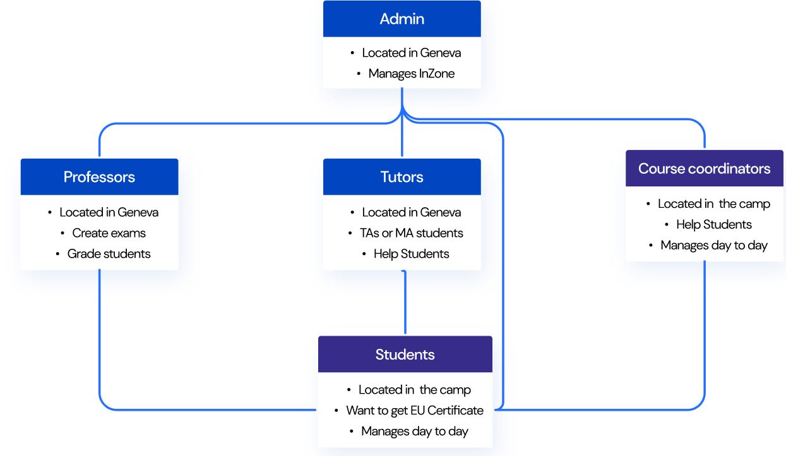

# Edunity Exam Portal - deploy(impact) InZone - team B
Brings students in refugee camps and University collaborators together in a single platform to create a sustainable access to Higher Education.

#### More details about deploy(impact) InZone Challenge can be found [here](https://microsoft-we-innovate.agorize.com/en/challenges/womenplusplus-deploy-impact/pages/kona-connect?lang=en)

## Problem space:
- Poor internet connectivity affects the learning and teaching experience
- Students face an array of callenges that hinders their motivation to continue studying (e.g. extreme wather, distance in the camps...)
- The process to assign exams to students, grade them and share results is very manual and dependent on a centralized admin

## Who are we designing for


## Our value proposition:
1. Focus with **Offline Mode**
2. **Preserve academic integrity** with ExamMode
3. **Ideas exchange** with Messages platform
4. **Automate** tasks within a single platform
5. **Foster collaboration** between the different users

## App demo:
The app can be accessed via https://edunity.azurewebsites.net/
### Signup:
New user can perfrom signup with a unique email address.  
After signing up, the user can log in with provided email and password. However, but a verification from the admin is needed, in order for the new user to access the dashboard.
As part of the demo, a new user can be validated with this curl command (NOTE: remember to replace the *new_user@email* with actual email of the new user):  
```
curl -X PUT  https://edunity-backend.azurewebsites.net/student/new_user@email -H "Content-Type: application/json" -d "{\"validated_by_admin\":true}"
```  
After running this command, on the next log in, the new user should see the dashboard.

### Take exams from the dashboard:
Some of the user account has already been assigned some exam. For the purpose of demo, let us use the account edunity@gmail.com (password: Edunity12)
Before login with this account, it is recommended to reset the exam of this account. To do so, run the command:
```
curl -X PUT  https://edunity-backend.azurewebsites.net/testing/edunity@gmail.com/reset-exam-taken-time -d "{}"
```
We now can log in with edunity@gmail.com account, and start taking exams from the dashboard.

### Future improvements:
TODO

### Our team:
[Naia Magunagoikoetxea](http://naia.magunagoikoetxea.com) - UI/UX  
[Simo Vargas Paraschivoiu](http://simoparaschi.io) - UI/UX  
[Patricija Brečko](https://github.com/patricijab) - Frontend  
[Ezequias Calvo](https://github.com/EzequiasCalvo) - Frontend  
[Antonina Zubach](https://github.com/AntoninaZubach) - Backend  
[David Nguyen](https://github.com/davidnhtd) - Backend  
[Brandi Revels] - Scrum & Management
